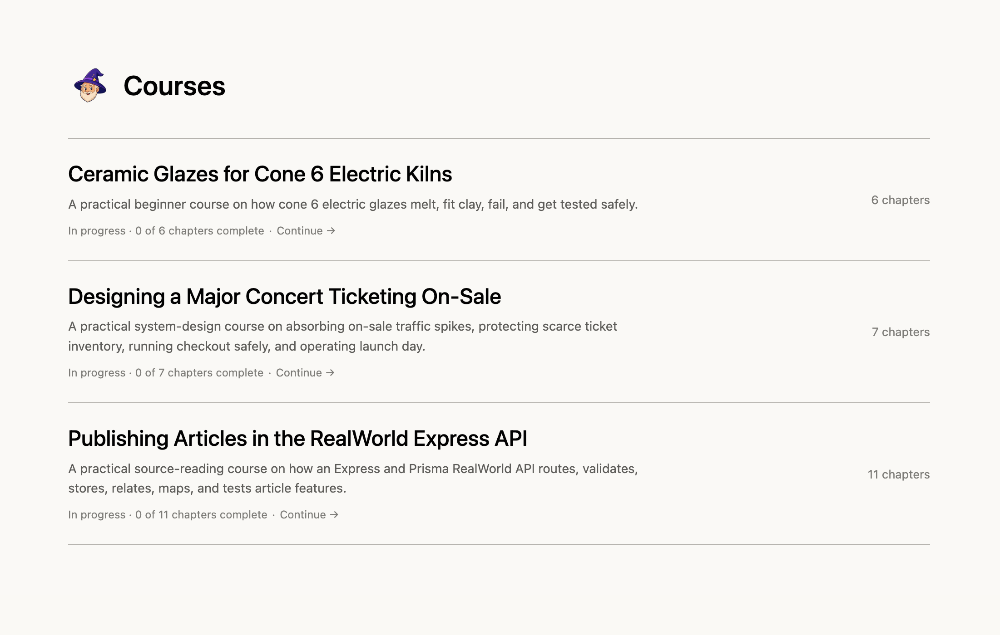
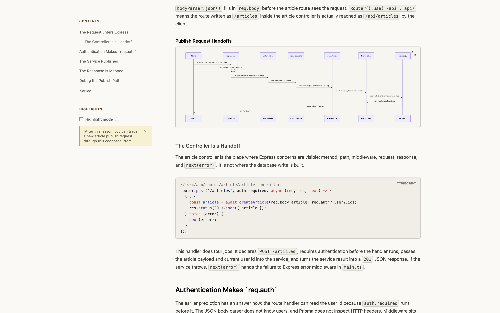
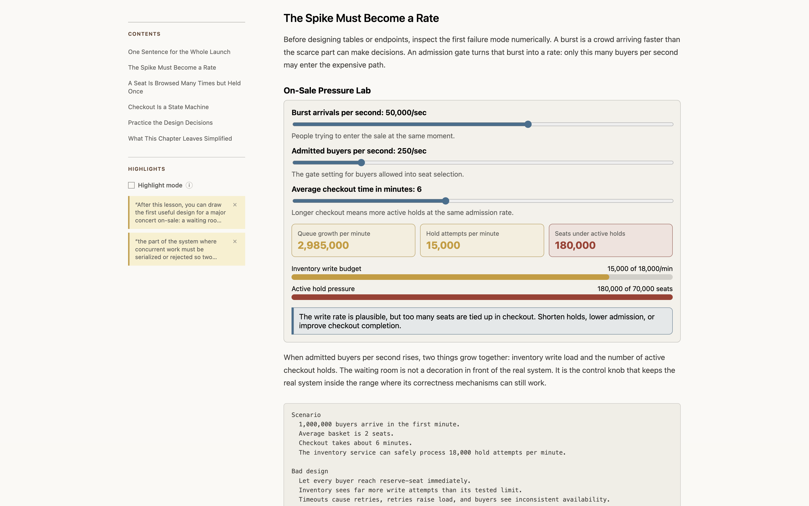
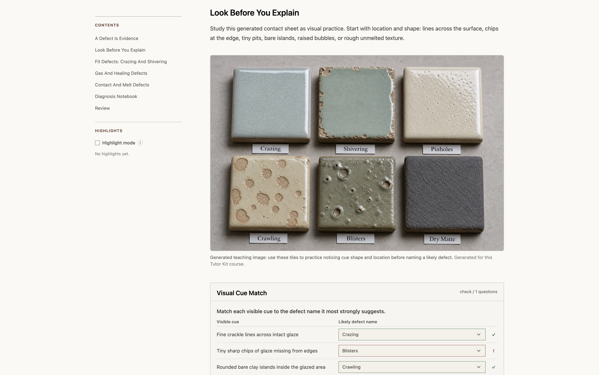

<div align="center">


# The Personal Tutor Skill

**Turn your coding agent into a tutor that learns how you learn.**



</div>

You can ask an AI to explain almost anything. But have you ever actually *learned* something hard from a chat window? You ask a question, you get a wall of text, you nod along, you scroll, and three days later you remember approximately none of it. Chat is a great place to get answers. It's a pretty bad place to learn.

That's because learning isn't reading. It's doing. It's answering a question *before* you see the explanation. It's changing a number in a simulation and watching the system react. It's writing code, running it, and finding out you were wrong in an interesting way. In a chat, all of those moments flatten into more text in a very long scroll.

Personal Tutor gives your coding agent an actual teaching toolkit instead. It builds real courses, locally, out of things like:

- Clear lessons and worked examples
- Images, diagrams, charts, and visual explanations
- Interactive simulations and small experiments
- Multiple choice and matching quizzes with feedback
- Runnable coding exercises with answer checking
- Glossaries and flashcards for later review
- Fully custom interfaces when a topic needs something weird (more on this below)

## A tutor that remembers you

Here's the thing about a good human tutor: half their value isn't what they know, it's what they know *about you*. They remember that you already get recursion but freeze up on off-by-one errors. They remember you like diagrams. They don't re-explain chapter one every Tuesday.

Your coding agent, by default, has the memory of a goldfish. Every new session, you're a stranger again.

Personal Tutor fixes that by keeping your courses, progress, quiz results, coding attempts, and study history together in `~/.personal-tutor`. When your agent writes the next lesson, it reads that history first. It checks what you've finished, where you struggled, and how you like things explained. The more you use it, the better it gets at teaching *you specifically*, which is kind of the whole point of the word "personal."

## What's up with the fancy UI?

I'm glad you asked! This is my favorite part, and it's a bit of a have-your-cake-and-eat-it-too situation 😁.

Coding agents can build genuinely wonderful custom interfaces, and that flexibility is one of the coolest things about them. But asking an agent to hand-write a quiz component, a progress tracker, and a chart renderer from scratch for every single lesson is slow, expensive, and burns a pile of tokens reinventing the same wheels. Nobody needs their tutor to lovingly craft a bespoke multiple-choice button for the 40th time.

So Personal Tutor ships with a kit of polished, pre-built teaching components as part of the skill. The agent invokes quizzes, flashcards, diagrams, charts, glossaries, and coding exercises with a few lines of code, which is fast, cheap, and token-efficient. And when a topic genuinely calls for something unusual (a little traffic simulator, a kiln temperature explorer, whatever), the agent can still drop down and write raw TypeScript, JSX, CSS, Canvas, SVG, or WebGL.

Sturdy building blocks for the common stuff, full creative freedom for the moments that make an idea click. Best of both worlds.

## See it in action

Here are three courses made from simple prompts. They all live in the same local library, even though the subjects have almost nothing in common. That's part of the fun of having an "expert in everything" as your tutor.

### Learn an unfamiliar codebase

> **Prompt:** Teach me how the Node Express Realworld Example App handles publishing a new article. I'm comfortable with TypeScript, but I'm new to Express and Prisma.



*Follow a real request through the codebase and see how the routes, middleware, application logic, and database calls fit together.*

### Explore system design through simulation

> **Prompt:** Teach me how to design a concert ticketing system for a major on-sale. I understand APIs and databases, but I’m not sure how to handle the traffic spike, prevent seats from being double-booked, or manage the checkout flow.



*Change the arrival rate, admission rate, and checkout time. Then watch what happens to the queue and active seat holds.*

### Practice with visual examples

> **Prompt:** Teach me how ceramic glazes work. I’m a beginner potter using cone 6 clay in an electric kiln. I want to understand glaze ingredients, common defects, and how to start testing my own recipes safely.



*Compare glaze defects, spot the visual clues, and check your answer inside the lesson.*

## Quick start

Personal Tutor requires Node.js 20.19 or newer.

### 1. Install

For Codex:

```bash
npx personal-tutor@latest
```

For Claude Code:

```bash
npx personal-tutor@latest --agent claude-code
```

For both:

```bash
npx personal-tutor@latest --agent all
```

You can run `npx personal-tutor@latest --help` to see the other install options.

### 2. Ask your coding agent to build a course

Use `$personal-tutor` in Codex or `/personal-tutor` in Claude Code. Then describe what you want to learn and what you already know:

> Teach me 1D dynamic programming for technical interviews. I understand recursion, but I struggle to recognize when to use DP.

Personal Tutor may ask a few questions before it creates the first chapter, just as a good tutor would ask what you already know before starting a lesson.

### 3. Open the course

```bash
npx personal-tutor@latest dev
```

Claude Code users can run `npx personal-tutor@latest dev --agent claude-code`.

Your courses and learning history stay in `~/.personal-tutor`.

> [!WARNING]
> Personal Tutor can run course code and browser components. Only open courses and workspaces you trust.

### 4. Continue later

Come back tomorrow, next month, or whenever the motivation strikes, and just ask:

> Continue my dynamic programming course.

Personal Tutor picks up the existing course, checks your saved progress, and figures out what should come next. No "as I mentioned in our previous conversation" required.

## Development

```bash
npm install
npm test
npm run build:skill:check
```

## License

Personal Tutor is licensed under the Apache License 2.0.
